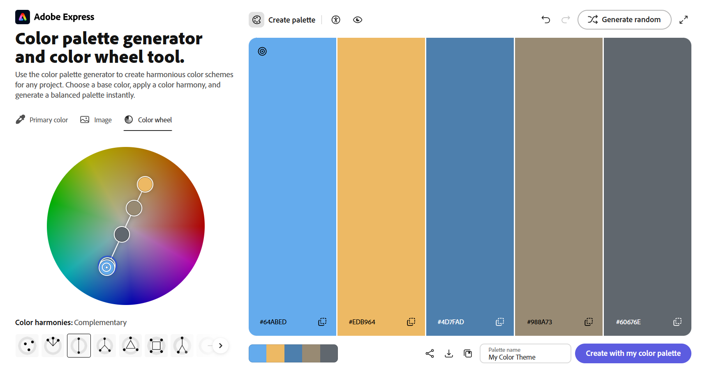

## Lift Tracker
A basic two-tier web application using HTML/CSS/JS and Node.js for logging gym sets and their estimated one rep maxes (ORM). Users can log an exercise (exercise name, weight, and rep count) through a form. The server then computes each set's estimated ORM through Epley's formula: ORM = weight * (1 + reps / 30). The server then returns the full dataset of lifts.

Owen Nguyen
Live Site: https://a2-owennguyen.onrender.com/

CSS Positioning Technique: 
- Used `display: flex` to position the content of the two cards. If the user is on a mobile device, the cards are positioned in a single column for ease of viewing. If the user is on a wider screen (at least 500px), then the cards will render as a row.

Instructions:
1. Fill in exercise, weight (lbs), and reps. Then click **Add Lift**.
2. Click **Delete** on any row to remove that lift.

## Technical Achievements
- **Single-Page App With Live Data Sync**: I created a single-page app that provides a form for users to submit data (Add lift form). It always shows the current state of the server (List of lifts). I do this through the endpoints `POST /addLift`, `POST /deleteLift`, and `GET /lifts`. When the user adds a lift, `POST /addLift` is called via `fetch` to add the lift to the list (through the form submitted by the user; includes exercise, weight, reps). When the user deletes a lift, `POST /deleteLift` is called via `fetch` to delete the specific lift (via its `ID`) from the list. In both of these cases, the server returns the full updated list of lifts for the client to render. On a page load, `GET /lifts` is called via `fetch` to load the current state of the list of lifts to the page. Using these endpoints, the current state of the server is always shown.

### Design/Evaluation Achievements
- **Student Tests**:
    - Test 1
        - Raghavan Rajkumar
        - He found that resizing to from desktop to mobile worked, but he wanted the list of lifts to collapse even more (horizontally). He felt it wasn't thin enough.
        - He said the blue color scheme was similar to a workout app he used, which is actually what I based it off of.
        - I would alter the media queries to make the list of lifts collapse more horizontally, making it more thin.
    - Test 2
        - Christian Dell'Anno
        - He had a problem with all the empty space on the wide-screen version of my site. Also, he would have preferred if the color for the delete button was red.
        - When talking through using the website using think-aloud-protocol, he found it very intuitive and easy to use my website.
        - I would size up the wide-screen version of my site (table size, font size, etc.). I might also add an "edit field" card to fill up even more space. However, I would not change the delete button from yellow to red -- yellow was in my color palette, and it is still a warning color.
- **Mobile-First Design**: *(Learned from reading)* Initially built app for narrow viewports, and then wrote a media query for screens wider than 500px. Screens less than 500px had `flex-direction: col;`, while screens 500px and up had `flex-direction: row;`.
- **CSS `nth-child` Math**: *(Learned from reading)* Used `nth-child` CSS math `#lifts-table tr:nth-child(even)` to generate a different color row background for even rows.  
- **Color Palette**: I used this color palette from Adobe's color palette generator:
